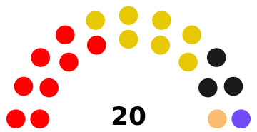

# List of parties

## Major parties
Quartz: 6 - #FF0000
- Quartz Radicals: 2 - #A50000

Jekyll: 7 - #E6C805

## Independents/Fringe
Notionites: 3 - #191919

Zolist: 1 - #714AF8

Wixer: 1 - #FBBD71

[How to update](updatepolitics.html)

Visualisation all thanks to [this](https://github.com/slashme/parliamentdiagram)
